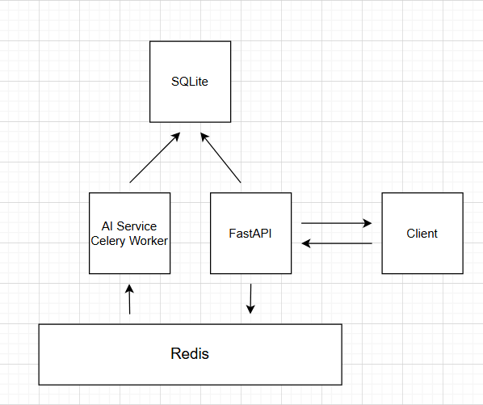
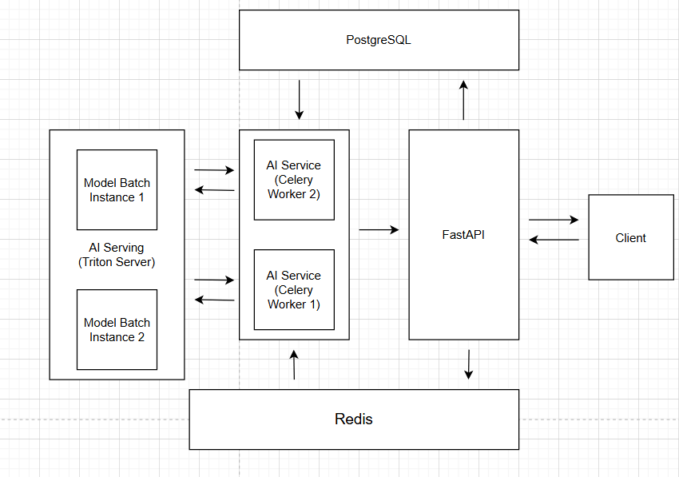

# Vocal Remover

API sử dụng FastAPI tách giọng hát và nhạc đệm bằng Spleeter, kết hợp xử lý bất đồng bộ thông qua Celery và Redis.

## Features
- Sử dụng JWT để bảo mật API
- Task status and history
- Tách nhạc dưới backgound bất đồng bộ thông qua Celery và Redis
- Simple rate limit (2 requests mỗi 30 giây)

## Tech Stack
- FastAPI
- Celery + Redis
- SQLite
- Open-source [Spleeter](https://github.com/deezer/spleeter/tree/master) cho phần AI tách nhạc



## Quick Start (Docker Compose)
```bash
docker compose up --build
```

The API will be available at `http://127.0.0.1:8000`.

Tối ưu khi có tệp `warmup.mp3` trong thư mục `data/sample/`. Ứng dụng sẽ chạy preload và tự động tải xuống weights mô hình. Nếu không, ứng dụng sẽ skip và sẽ tự động download trong lần chạy AI đầu tiên.

## API Overview
All endpoints are under `/api/v1`.

### Auth
`POST /login`

Quá trình khởi động, database sẽ tạo sẵn user với thông tin và form request như sau:

*Example:* 
```bash 
curl -X POST "http://127.0.0.1:8000/api/v1/login" \
  -H "Content-Type: application/json" \
  -d "{\"email\":\"test@example.com\",\"password\":\"password123\"}"
```

Request:
```json
{
  "email": "test@example.com",
  "password": "password123"
}
```

Response:
```json
{
  "access_token": "JWT",
  "token_type": "bearer"
}
```

**Note**:
 Sử dụng `Authorization: Bearer <access_token>` cho các API bảo mật liệt kê ở dưới.

### User Information
`GET /me`

*Example:*
```bash
curl -X GET "http://127.0.0.1:8000/api/v1/me" \
  -H "Authorization: Bearer <access_token>"
```

Response:
```json
{
  "email": "test@example.com",
  "credits": 10
}
```
### Audio Separation
`POST /separate`

*Example:*
```bash
curl -X POST "http://127.0.0.1:8000/api/v1/separate" \
  -H "Content-Type: application/json" \
  -H "Authorization: Bearer <access_token>" \
  -d "{\"filename\":\"example.mp3\"}"
```
Request:
```json
{
  "filename": "example.mp3"
}
```

Notes:
- File phải có sẵn ở folder `data/sample/`
- Hiện tại chỉ xử lý được file `.mp3`.
- Rate limit: tối đa 2 requests mỗi 30 giây.

Response:
```json
{
  "task_id": "uuid"
}
```

### Status
`GET /status/{task_id}`

*Example:*
```bash
curl -X GET "http://127.0.0.1:8000/api/v1/status/<task_id>" \
  -H "Authorization: Bearer <access_token>"
```

Response:
```json
{
  "task_id": "uuid",
  "status": "queued|processing|completed|failed"
}
```

### History
`GET /history`

*Example:*
```bash
curl -X GET "http://127.0.0.1:8000/api/v1/history" \
  -H "Authorization: Bearer <access_token>"
```

Trả về danh sách các tasks của user hiện tại.

Response:
```json
[
  {
    "task_id": "uuid",
    "status": "queued|processing|completed|failed",
    "original_file_path": "path/to/file",
    "vocal_path": "path/to/file",
    "music_path": "path/to/file",
  },
  {
    "task_id": "uuid",
    "status": "queued|processing|completed|failed",
    "original_file_path": "path/to/file",
    "vocal_path": "path/to/file",
    "music_path": "path/to/file",
  }
]
```

## KẾT QUẢ
Kết quả các file đã xử lý sẽ nằm ở đường dẫn:
- Giọng nói: `data/output/<source_name>/vocals.wav`
- Nhạc nền: `data/output/<source_name>/accompaniment.wav`

## TRẢ LỜI CÂU HỎI TƯ DUY
### Concurrency
Nếu 100 user cùng upload nhạc một lúc, hệ thống thiết kế có thể có dạng như sau:


- Mô hình inference ở dạng batch (Batch Inference) giúp xử lý đồng thời nhiều request
- Sử dụng Serving (Triton, BentoML, ...) để host các mô hình, có thể scale tự động cũng như xử lý lượng lớn request
- Tăng số lượng các worker để tăng tốc độ lấy và xử lý dữ liệu chờ ở queue Redis

### Scalability
Nếu tập âm thanh dài hơn 10 phút:
- Có thể xử lý bằng cách chia nhỏ các đoạn âm thanh (ví dụ chia thành 5 đoạn nhỏ, mỗi đoạn 2 phút)
- Dùng mô hình với batchsize = 5 để gom 5 đoạn nhỏ này thành 1 request để xử lý đồng thời hoặc để ở queue để xử lý tuần tự

### Model Optimization
- Chuyển qua chạy ở chế độ GPU với phần cứng GPU
- Convert về các dạng mô hình tham số nhẹ hơn (float32, float16, int8)
- Convert về các dạng mô hình tối ưu riêng cho từng loại phần cứng (Onnx, TensorRT cho Nvidia, ...)
